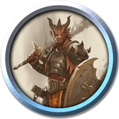
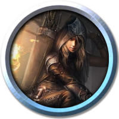
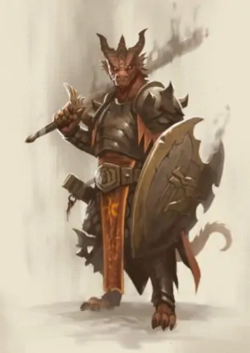
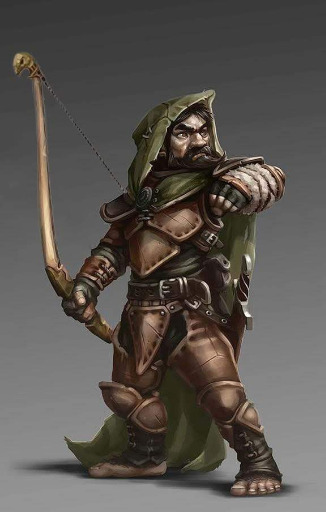

# Player Characters

[This is the way back to the main page!](../index.md)

 - [Balasar](index.md#balasar)
 - [Biriel](index.md#biriel)
 - [Flint](index.md#flint)
 - [Kana](index.md#kana)
 - [Rika](index.md#rika)
 - [Yaatraka](index.md#yaatraka)
 
|Character Stats | Balasar | Biriel | Flint | Kana | Rika | Yaatraka |
| ---:           | :-----: | :----: | :---: |:---: |:---: | :------: |
| |||||||
|HP              | 49      |  47    | 38    | 27   | 49   | 32
|AC              | 19      | 12     | 15    | 18   | 16   | 14
|STR             | +4      | -1     | +2    | -1   | +1   | -1
|DEX             | +1      | +0     | +3    | +4   | +4   | +3
|CON             | +3      | +4     | +1    | +1   | +3   | +3
|INT             | +1      | +2     | +0    | -1   | +0   | +1
|WIS             | +1      | +5     | +3    | +3   | +3   | +1
|CHA             | +2      | +4     | +1    | +0   | +2   | +5
|Passive Perception| 11    | 18     | 16    | 13   | 16   | 11
|Saves  | WIS, CHA | INT, WIS | INT, WIS | STR, DEX | STR, DEX | WIS, CHA
| Speed          | 30 ft.  | 30 ft. | 25 ft.|40 ft.|30 ft.| 30 ft.
| Darkvision     | -       | 60 ft  | 60 ft.| -    |60 ft.| 60 ft.
 

# Balasar
]

- Languages: Daconic, Dwarvish
- Resistance: Fire
- Tools: Dice Set

# Biriel

- Languages: Celestial, Druidic
- Resistances: Necrotic, Radiant
- Tools: Herbalism Kit, Brewers Supplies

# Flint

Hallo!
Ich bin Flint, landauf und landab bekannt als der beste Bogenschütze aller Zeiten!
Zwar bin ich in einem Waisenhaus aufgewachsen, aber es ist ein offenes Geheimnis das ich aus einer königlichen Zwergenfamilie stammen muss, die für ihre Heldentaten bekannt war.
Ich habe meinen Dienst bei der Armee abgebrochen, weil ich zu schnell zu viel erreicht hatte und mir das langweilig geworden ist, aber wenigstens habe ich im Soldatenleben das Harfe spielen gelernt.

Damit verdiene ich jetzt auch mein Geld: Ich ziehe durch die Länder und singe und erzähle meine Geschichten.

Wenn du etwas Zeit und etwas Gold hast, setz dich zu mir ans Lagerfeuer und ich erzähle dir etwas!

- Languages: Dwarvish
- Resistance: Poison, Adv. on saving throws against being poisoned
- Tools: Forgery Kit, Smith's Tools, Harp

# Kana

Every Great Character starts with a picture

- Languages: Oricsh
- Resistances: -
- Tools: Brewer's Supplies, Disguise Kit, Pan Flute

# Rika

- Languages: Elvish, Oharan
- Resistances: Adv. on saving throws against being Charmed.
- Tools: Disguise Kit, Playing Card Set

# Yaatraka

- Languages: Infernal, Abyssal, Elvish, Bits of Oharan
- Resistances: Adv. on saving throws against being Charmed
- Tools: Wind Pipes
- Special: Lasting Sacrifice